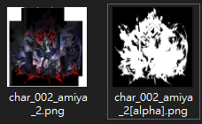
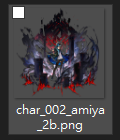
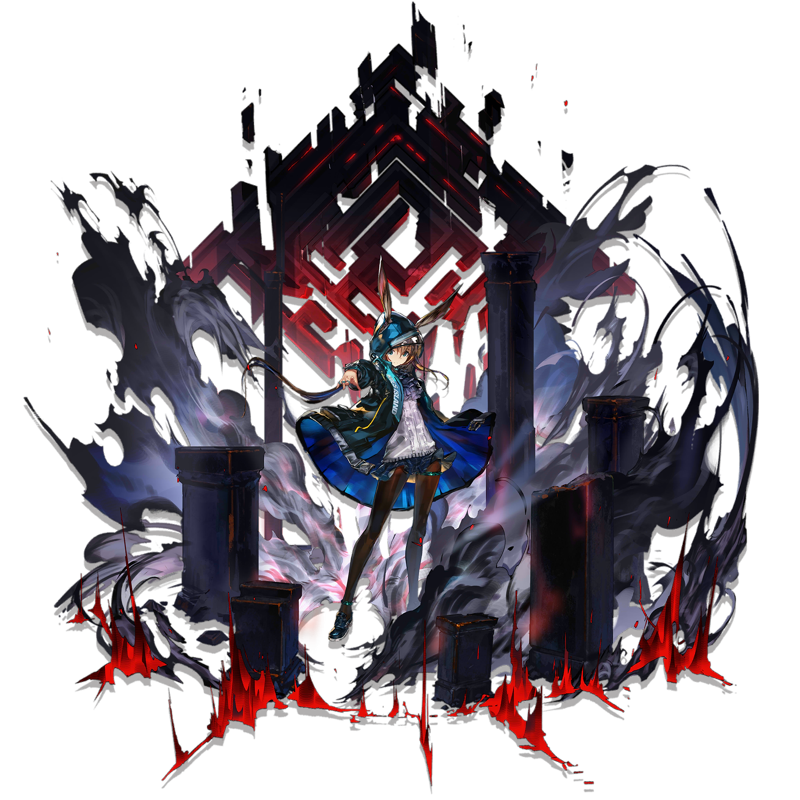

# README.md

    merge source.png with mask.png to alpha.png

## install

```
yarn add alpha-mask
```

## demo



=>



## code

```ts
import { createWriteStream, pathExistsSync, ensureWriteStream, outputFile } from 'fs-iconv';
import { mergeMaskByFile, generateAsync, outputAsync } from 'alpha-mask';
import FastGlob from '@bluelovers/fast-glob/bluebird';
import * as path from 'path';

mergeMaskByFile(path.join(__dirname, './res/char_002_amiya_2.png'), path.join(__dirname, './res/char_002_amiya_2[alpha].png'))
.then(img => {
	return outputAsync(path.join(__dirname, 'out.png'), img)
})
;
```

---



